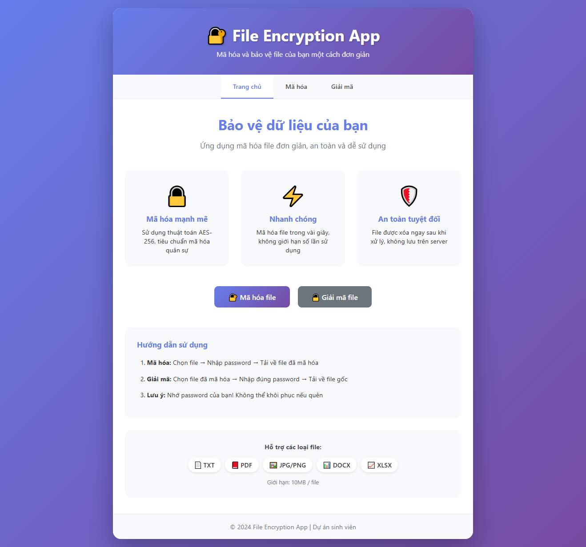
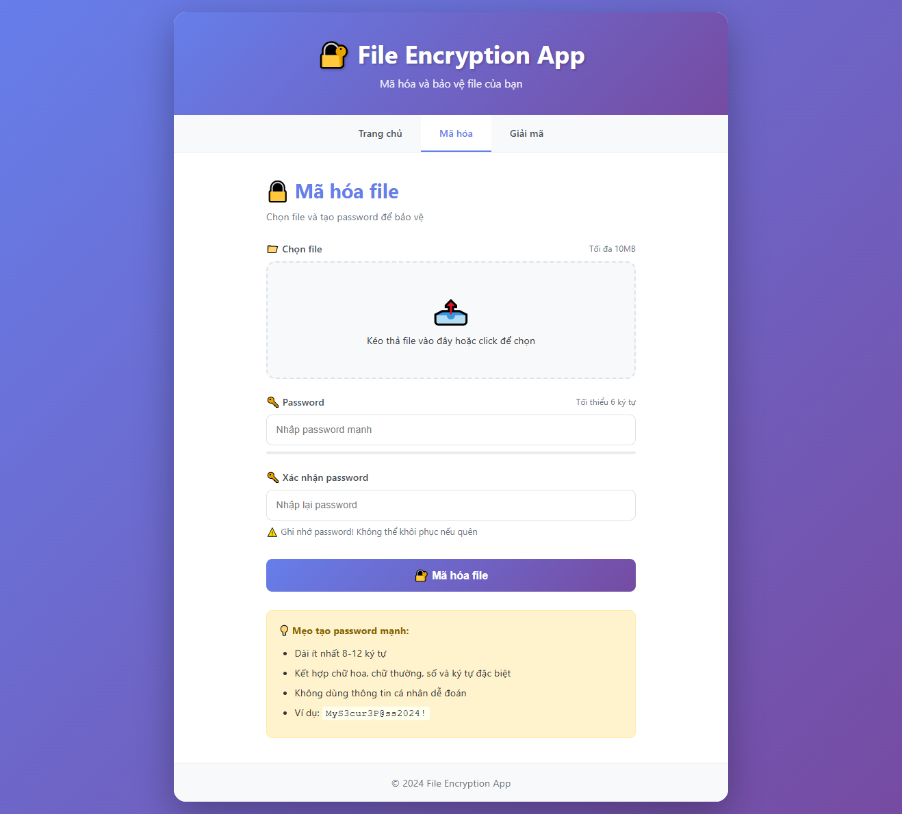
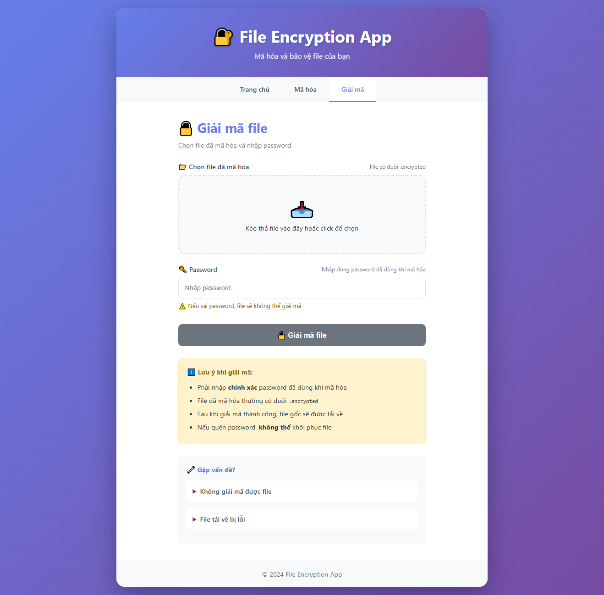

# 🔐 Secure File Encryption Web Application

A web-based application that enables users to securely encrypt and decrypt files using military-grade AES-256 encryption standard.

## 📋 Table of Contents

- [Features](#features)
- [Demo](#demo)
- [Technologies](#technologies)
- [Installation](#installation)
- [Usage](#usage)
- [Project Structure](#project-structure)
- [Security Features](#security-features)
- [What I Learned](#what-i-learned)
- [Future Enhancements](#future-enhancements)
- [License](#license)
- [Contact](#contact)

## ✨ Features

- 🔐 **Military-grade encryption**: AES-256 bit encryption standard
- 📁 **Multiple file format support**: PDF, Images (JPG, PNG), Documents (DOCX, XLSX), Text files
- 🔑 **Password-based encryption**: SHA-256 password hashing for key derivation
- 💪 **Password strength validator**: Real-time feedback on password quality
- 📤 **Drag-and-drop upload**: User-friendly file upload interface
- 🎨 **Responsive design**: Seamlessly works on desktop and mobile devices
- 🔒 **Security first**: Automatic file cleanup, input validation, secure file handling
- ⚡ **Fast processing**: Efficient encryption/decryption for files up to 10MB
- 🌐 **Intuitive UI**: Modern, clean interface with visual feedback

## 🎥 Demo

### Screenshots

**Home Page**

**Encryption Page**

**Decryption Page**

> **Note:** Add your screenshots to the `screenshots/` folder

## 🛠️ Technologies

### Backend
- **Python 3.8+**: Core programming language
- **Flask 2.3+**: Web framework
- **Cryptography**: Fernet (AES implementation)
- **Hashlib**: SHA-256 password hashing
- **Werkzeug**: Secure filename handling

### Frontend
- **HTML5**: Structure
- **CSS3**: Styling with modern features
